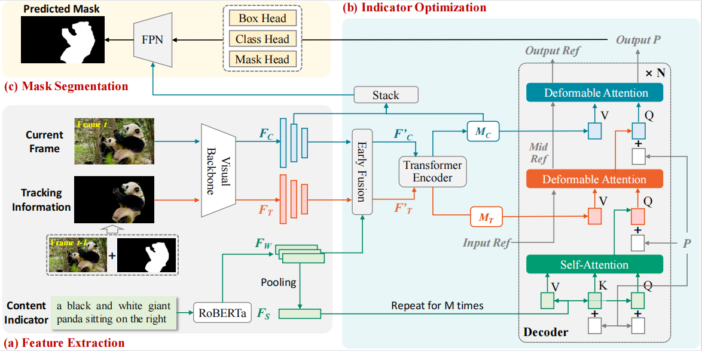

[](https://opensource.org/licenses/Apache-2.0)
[](https://pytorch.org/)


The official implementation of the **ACM MM 2024** paper: 

<div align="center">
<h1>
<b>
Tracking-forced Referring Video Object segmentation 
</b>
</h1>
</div>

<p align="center"></p>

> **Tracking-forced Referring Video Object Segmentation**
>
> Ruxue Yan, Wenya Guo*, Xubo Liu, Xumeng Liu, Ying Zhang, Xiaojie Yuan
>
>[[paper]](https://openreview.net/pdf?id=PATBoYAHib)


## Requirements

We test the codes in the following environments, other versions may also be compatible:

- CUDA 11.3
- Python 3.7.16
- Pytorch 1.10.0


## Installation

Install the necessary packages and pycocotools.

```
pip install -r requirements.txt 
pip install 'git+https://github.com/facebookresearch/fvcore' 
pip install -U 'git+https://github.com/cocodataset/cocoapi.git#subdirectory=PythonAPI'
```

Finally, compile CUDA operators.

```
cd models/ops
python setup.py build install
cd ../..
```

## Data Preparation

Please refer to [data.md](https://github.com/wjn922/ReferFormer/blob/main/docs/data.md) for data preparation.

Pretrained model we used for different visual backbones are sourced from [ReferFormer](https://github.com/wjn922/ReferFormer/tree/main). You may download them from the [Model Zoo](https://github.com/wjn922/ReferFormer/blob/main/README.md) and put them in the directory `pretrained_weights`.


After the organization, we expect the directory struture to be the following:

```
ReferFormer/
├── data/
│   ├── ref-youtube-vos/
│   ├── ref-davis/
│   ├── a2d_sentences/
│   ├── jhmdb_sentences/
├── davis2017/
├── datasets/
├── models/
├── scipts/
├── tools/
├── util/
├── pretrained_weights/
├── eval_davis.py
├── main.py
├── engine.py
├── inference_ytvos.py
├── inference_davis.py
├── opts.py
...
```

## Get Started
Taking ytvos dataset and resnet50 as an example:

### training
```
./scripts/dist_train_test_ytvos.sh ytvos_dirs/r50 pretrained_weights/r50_pretrain.pth --backbone resnet50 
```

### inference
```
python3 inference_frame_key.py --with_box_refine --binary --freeze_text_encoder --output_dir=ytvos_dirs/r50 --resume=ytvos_dirs/r50/checkpoint.pth --backbone resnet50
```


## Acknowledgement

This repo is based on [Deformable DETR](https://github.com/fundamentalvision/Deformable-DETR) and [VisTR](https://github.com/Epiphqny/VisTR). We also refer to the repositories [ReferFormer](https://github.com/wjn922/ReferFormer/tree/main). Thanks for their wonderful works.


## Citation

```
@inproceedings{yan2024tracking,
  title={Tracking-forced Referring Video Object Segmentation},
  author={Yan, Ruxue and Liu, XuBo and Liu, Xumeng and Zhang, Ying and Yuan, Xiaojie and others},
  booktitle={ACM Multimedia 2024},
  year={2024}
}
```

